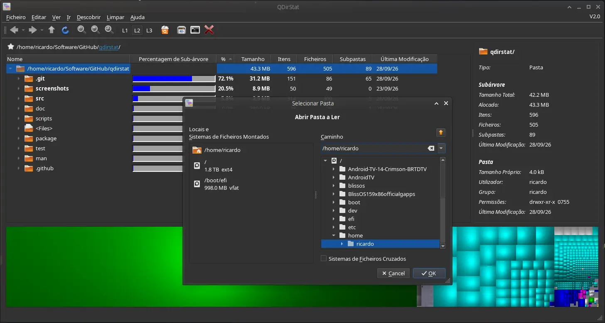
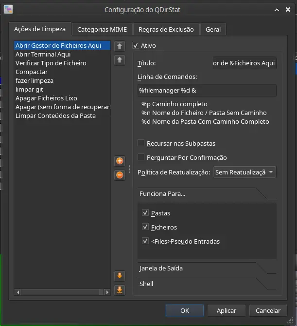
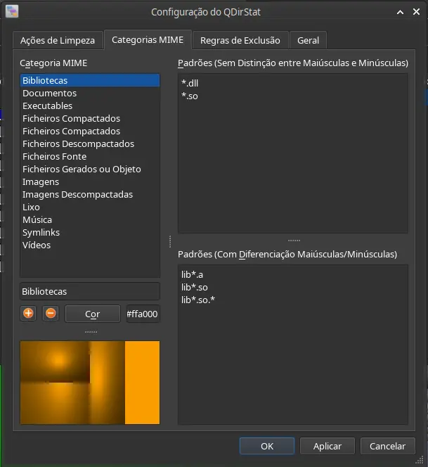
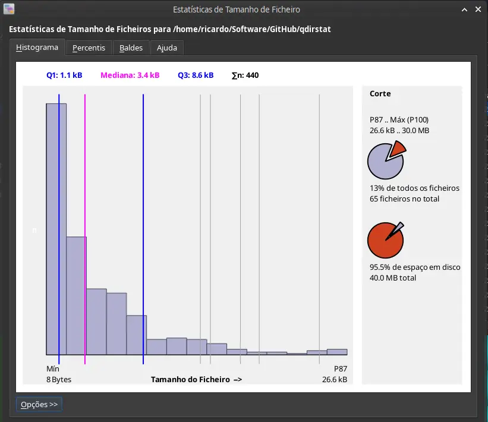
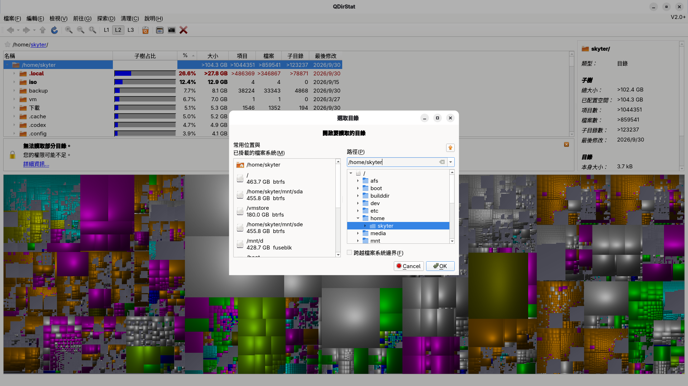
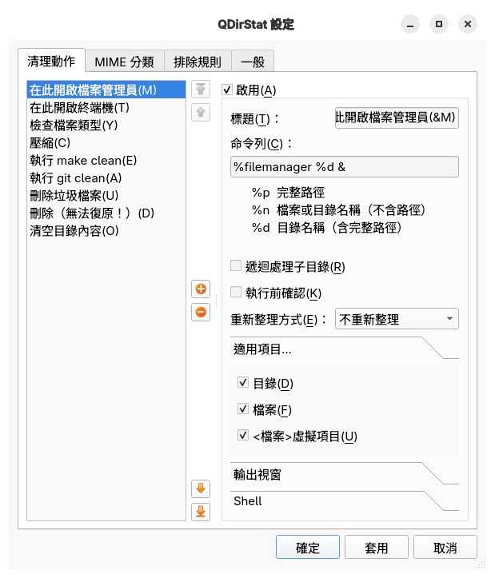
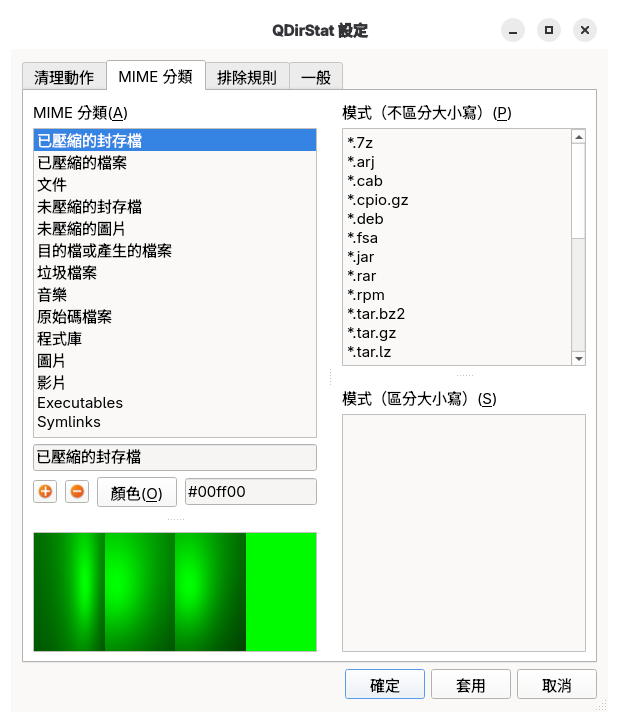
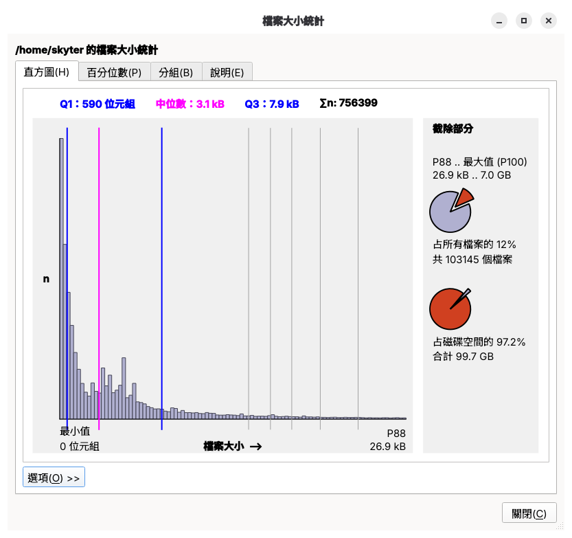

# qdirstat-lang

Translations for [QDirStat](https://github.com/shundhammer/qdirstat). 

## Contributing

Want to add or update a translation? See [CONTRIBUTING.md](CONTRIBUTING.md) for the workflow.

## Available languages so far

### Portuguese (`pt_PT`)

A European Portuguese translation for QDirStat is available in [`po/pt_PT.po`](po/pt_PT.po).
- The translation has been tested with QDirStat 2.0-git.

Screenshots

#### Main window

#### Cleanup settings

#### MIME categories

#### File size statistics

### Traditional Chinese (`zh_TW`)

A Traditional Chinese translation for QDirStat is available in [`po/zh_TW.po`](po/zh_TW.po).

- The translation has been tested with QDirStat 2.0.01-git on Fedora 44.

Screenshots

#### Main window

#### Cleanup settings

#### MIME categories

#### File size statistics

### Simplified Chinese (`zh_CN`)

A Simplified Chinese translation for QDirStat is available in [`po/zh_CN.po`](po/zh_CN.po).

- The translation has been tested with QDirStat 2.0 on Ubuntu 26.04 (KDE/Wayland)

## Stats

